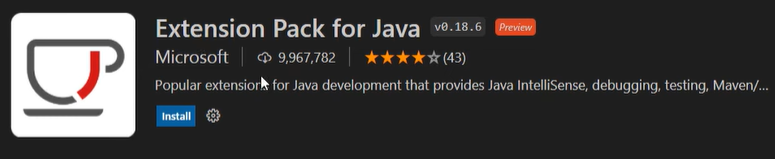
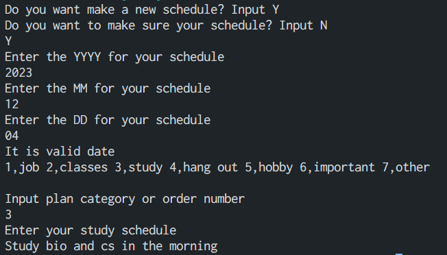
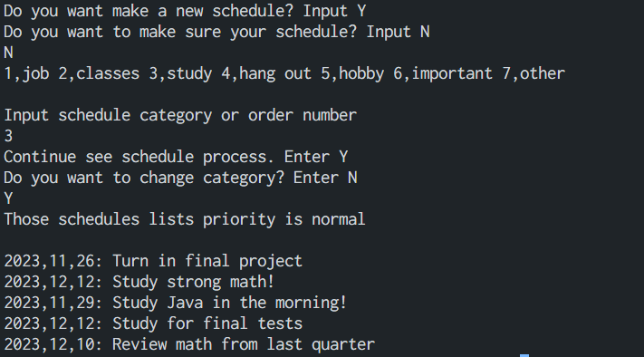

# ToDoFinal

## To do list application description

I make console to do list application for final project. This app have two main functions. 
1, You can make and write your schedule to txt file.
2, You can see and make sure your schedule by each categories. 

- Error handling and exeption

This app has mainly this two functions but other function that error and exception handling.
To be honest, those handling program took time more than make main two functions. 
When make new schedule is for example if input not Y or N, question will loop and you can input Y or N again.
Other one is input day is past or not. I use calender class, so I can compare past or not.

- Challenge part

Using calender class for get day and compare days. It is first time ti use calender class but it was useful.
As I mentiond but error and exception handling was took time for debug. And main reasons why code are get longer is this. Use three object oriented programing concept was hard for me but make me learn so much. 

Summary of this each java code contained this directory

Everything is contained in ToDoFinal directory except README file. 

- ToDoRun.java : Program can start this class, you can choose make new schedule or see schedule already exist.
- ToDo.java : This class can make new schedules.
- SeePlan.java : This class can make sure already exist schedule in the txt file.
- CategoryArray.java : This calass have abstract method for inharitance contained array.
- Category.java : This calass is interface for AbstractCategory. Having 2 getter and setter.
- AbstractCategory.java : Inplement Category class. Super class of Ctg classes.

- Categories directory: Contain Ctg classes for each schedule categories.

## Instration
This program does not need to any adittional resources and software. 
You can run Geany but I'm using VS code. So I would like to write down VS code instration instruction.

1, Download from here https://code.visualstudio.com/download. 
2, After download VS code, I assume you have already download java.
Open the VS code and you need to install extention called "Extention Pack for Java". 
You can search "Extention Pack for Java" from left side search button.
picture is below.

3, If you find extention, press install button. All set to use VS code.

This two video is very useful to install VS code.
https://www.youtube.com/watch?v=JPZsB_6yHVo
https://www.youtube.com/watch?v=79YpKXnjKeo

## Compile and Execute

You can run Geany or VS code any text edier is okay! 
Start from ToDoRun.java, press run button.
Choose make a new schedule is input Y, make sure your schedule is input N.

### Make a new schedule & Sample out put

1, Input year, month and day that you want to make schedule.
But you can not input past, you can input today or future.

2, Next is choose schedule categories. There are 7 categories,
you can choose appropriate category each schedules. 
Onece you chose schedule, it will write down by each category of files.

3, You can write schedule contents.

### Make sure your schedule & Sample out put

1, Choose and input schedule category or order number.

2, Choose continue to process is input Y, if you want to change category is inputN.

3, You can see selected category schedules.

## Work Citation

- Array
https://www.w3schools.com/java/java_arrays_loop.asp

- File
https://www.w3schools.com/java/java_files_create.asp
https://www.youtube.com/watch?v=fgjIk7qQong
https://www.youtube.com/watch?v=kjzmaJPoaNc

- Calender(Containd japanese artical sorry)
https://www.geeksforgeeks.org/calendar-class-in-java-with-examples/
https://www.tutorialspoint.com/java/util/java_util_calendar.htm
https://www.sejuku.net/blog/20275

- Encapsulation
https://www.geeksforgeeks.org/encapsulation-in-java/
https://favtutor.com/blogs/java-getters-and-setters
https://www.youtube.com/watch?v=eboNNUADeIc&t=288s

- Inharitance
https://www.geeksforgeeks.org/inheritance-in-java/
https://www.youtube.com/watch?v=Zs342ePFvRI

- Interface
https://www.w3schools.com/java/java_interface.asp
https://www.geeksforgeeks.org/interfaces-in-java/
https://www.baeldung.com/java-interfaces
https://www.youtube.com/watch?v=GhslBwrRsnw&t=1s

- Polymorphism
https://www.geeksforgeeks.org/polymorphism-in-java/
https://www.geeksforgeeks.org/overriding-in-java/
https://www.digitalocean.com/community/tutorials/overriding-vs-overloading-in-java
https://stackoverflow.com/questions/154577/polymorphism-vs-overriding-vs-overloading
https://www.youtube.com/watch?v=2hkngtWLGvE&t=296s

- Enum
https://www.geeksforgeeks.org/enum-in-java/
https://www.youtube.com/watch?v=TCMhP8trGwY

